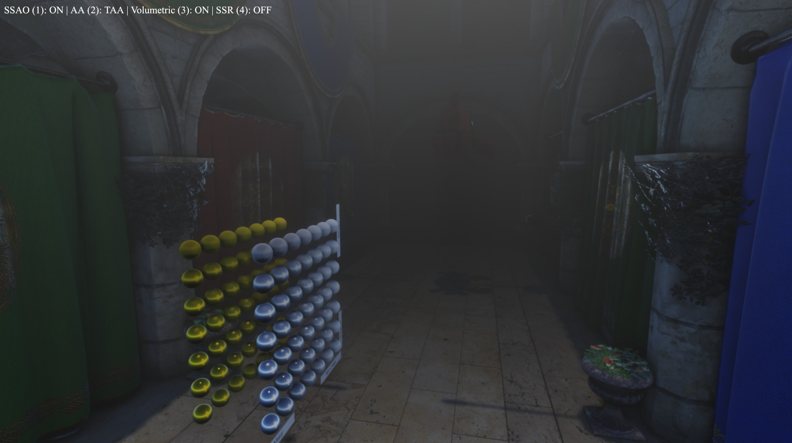

# Eureka Engine

Eureka is a high-performance, cross-platform 3D rendering engine built with **Rust** and **WGPU**. It features a modern **Clustered Forward Rendering** architecture and a decoupled multi-threaded design tailored for simulation stability and visual fidelity.



## 🚀 Key Features

### 🎨 Advanced Rendering
*   **Clustered Forward Rendering**: Efficiently handles hundreds of local light sources by partitioning the frustum into clusters.
*   **Froxel-based Volumetric Fog**: High-quality volumetric lighting and atmospheric scattering calculated in a 3D frustum voxel grid.
*   **Temporal Anti-Aliasing (TAA)**: Smooths edges and reduces shimmering using jittered projection and history accumulation with neighborhood clamping to eliminate ghosting.
*   **Physically Based Lighting (IBL)**: Support for Image-Based Lighting with automatic **Panorama-to-Cubemap** conversion and mipmap generation.
*   **Post-Processing Pipeline**: Includes SSAO, SSR, Bloom, FXAA, and Tonemapping, all managed via a flexible Render Graph.

### 🏗️ Architecture
*   **Decoupled Logic & Render Threads**: 
    *   **Logic Thread**: Runs at a **fixed 120Hz** using an accumulator-based loop for deterministic physics and stable simulation.
    *   **Render Thread**: Runs asynchronously with frame pacing (up to $n$-frames ahead), ensuring the UI remains responsive even under heavy GPU load.
*   **Dynamic Render Graph**: A dependency-aware graph that manages resource lifetimes and node execution order.
*   **Smart Resource Pooling**: Automatically reuses and recycles GPU textures and buffers to minimize allocation overhead and prevent memory leaks during resolution changes.

### 📦 Asset Pipeline
*   **Asynchronous Loading**: Background thread pool for model and texture loading using `rayon`.
*   **Automatic Conversion**: Directly import equirectangular HDRI panoramas; the engine automatically converts them to GPU-native Cubemaps on the fly.

## 🛠️ Tech Stack
*   **Language**: Rust
*   **Graphics API**: WGPU (WebGPU backend)
*   **ECS**: Hecs
*   **Math**: Glam
*   **Windowing**: Winit

## 🏁 Getting Started

### Prerequisites
Ensure you have the latest stable Rust toolchain installed.

### Running the Engine
```bash
# Clone the repository
git clone https://github.com/your-username/eureka.git
cd eureka

# Run the demo in release mode for best performance
cargo run --release
```

## 📈 Profiling
The engine includes a built-in real-time profiler displayed in the console:
*   **CPU Logic**: Time spent on ECS systems and world updates.
*   **CPU Render**: Time spent recording command encoders and preparing frame data.
*   **GPU**: Hardware-level timestamp queries for actual GPU execution time.

## 📜 License
This project is licensed under the MIT License.
